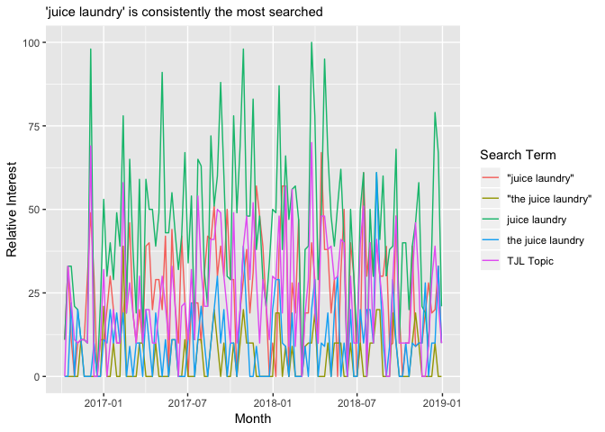
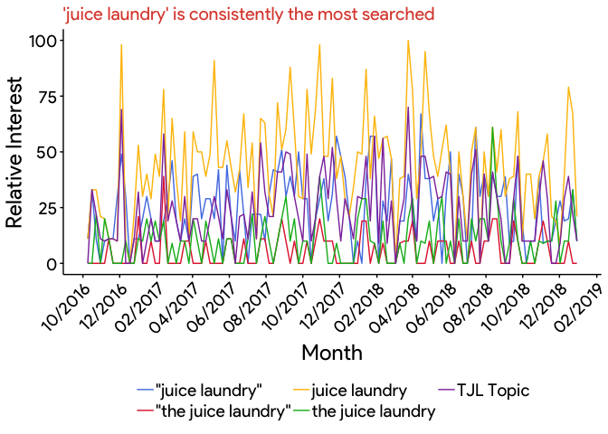
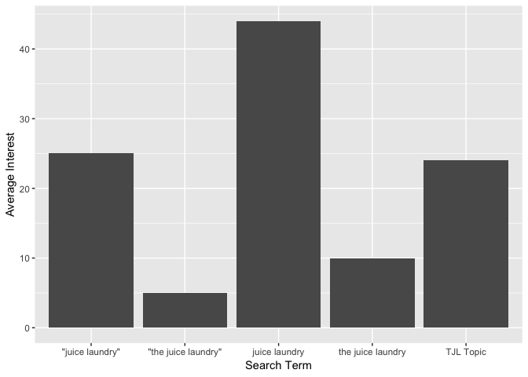
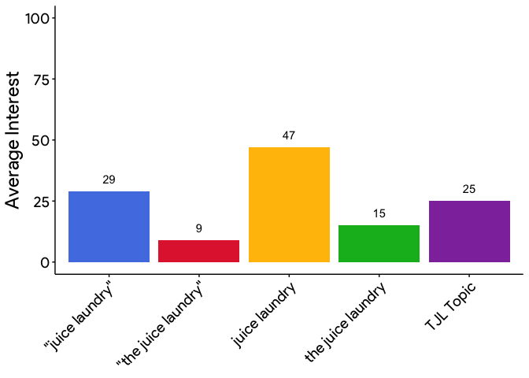
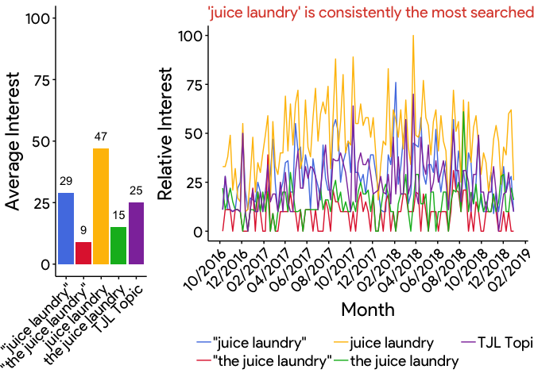

The Google Trends R Guide
================
A manual for *intelligent*, *reproducible*, and *programmatic* analysis of *Google Trends* search interest over time with the `gtrendsR` package

------------------------------------------------------------------------

### Table of Contents
-   [Overview](#overview)
-   [Understanding *Google Trends*](#understanding-google-trends)
-   [Navigating the User Interface (UI)](#navigating-the-user-interface-ui)
-   [Testing the `gtrendsR` package](#testing-the-gtrendsr-package)
-   [Replicating the *Google Trends* visuals](#replicating-the-google-trends-visuals)
-   [`thejuicelaundry` dataset](#thejuicelaundry-dataset)
-   [Corner Juice Search Terms Comparision](#corner-juice-search-terms-comparision)
-   [Corner Juice vs. TJL](#corner-juice-vs.-tjl)

------------------------------------------------------------------------

### Overview

First and foremost, you must understand what *Google Trends* is, how it retrieves data, what that data means, and what you can gain from it.

Then you can start to use it, first through the User Interface (UI) found <a href="https://trends.google.com/trends/?geo=US" target="blank">here</a> and later through the `gtrendsR` package.

The benefits of using an R package are numerous and will become more and more apparent throughout this guide. To summarize, an R package allows your analysis to be more *intelligent*, *reproducible*, and *programmatic*.

We will walk you through using Google Trends, pointing out some nuances along the way, and then we will show you how to generate the same exact data (and even the same visuals) with the `gtrendsR` package. We will apply everything to *The Juice Laundry* (TJL), demonstrating methods to extract data that is most useful and most accurate, and comparing that data to local competition, namely *Corner Juice*.

------------------------------------------------------------------------

### Understanding *Google Trends*

According to the *Google Trends Help* page...

*Google Trends* data is an unbiased sample of Google search data:

-   Only a percentage of searches are used to compile Trends data.

-   Samples are refreshed every day and so data from one day with differ slightly from data (with the same parameters) from another.

Search results are proportionate to the time and location of a search (commonly referred to as a query) by the following process:

-   Each data point is divided by the total searches of the geography and time range it represents to compare relative popularity. Otherwise, places with the most search volume would always be ranked highest.

-   The resulting numbers (what I will refer to as `relative_interest`) are then scaled on a range of 0 to 100 based on a topic’s proportion to all searches on all topics.

-   Different regions that show the same search interest for a term don't always have the same total search volumes.

Some data is excluded:

-   Searches made by very few people: Trends only shows data for popular terms, so search terms with low volume appear as "0."

-   Duplicate searches: Trends eliminates repeated searches from the same person over a short period of time.

-   Special characters: Trends filters out queries with apostrophes and other special characters.

The uses for *Google Trends* are plentiful. As <a href="https://www.bruceclay.com/newsletter/volume120/why-use-google-trends.htm" target="blank">bruceclay.com</a> highlights...

-   Google Trends offers a multidimensional view of queries and how they have evolved as a result of factors like seasonality, geographic location, and media coverage.

-   Data provided as relative popularity over time – not total search volume – can provide an apples to apples idea of query popularity.

-   Graphed media coverage incidents help marketers see direct correlations between media coverage and spikes in interest.

Along the lines of what this guide will show you, *Google Trends* is most practical for *benchmarking against competitors* and *understanding emerging trends* for a business or an industry.

------------------------------------------------------------------------

### Navigating the User Interface (UI)

If you do not already have it open, go to <a href="https://trends.google.com/trends/?geo=US" target="blank">Google Trends</a>.

*Step 1:* Enter 'the juice laundry' as your search term. Then change 'Past 12 Months' to a custom time range from October 9, 2016 (10-9-2016) to the end of 2018 (12-31-2018). These dates coincide with the time period of the `thejuicelaundry` package's *Square* transaction data.

Notice that you can also change the location, category, and search type (web, image, etc.) parameters, but leave them alone.

*Step 2:* Enter 'The Juice Laundry' (capitalized this time) as a second search term.

Both terms should say 'search term' under them. You will notice that only the red line shows. This is because the **search terms are case insensitive** and the trendlines are identical.

*Step 3:* Replace the second search term with "the juice laundry" (in quotes this time).

You will notice that the trendlines are different and that is because sourrounding the term in quotes creates a totally different query based on *Google's* algorithm. Navigate <a href="https://support.google.com/trends/answer/4359582?hl=en" target="blank">here</a> to see the results of queries that are different but that share similar terms. The takeaway is that **the algorithm is stricter on quoted terms** (because it only counts searches with that exact phrase) and the trendlines should reflect this ("the juice laundry" being generally lower then its non-quoted counterpart).

*Step 4:* Add 'juice laundry' and the quoted "juice laundry", in that order, as two more search terms.

The resulting trendlines will be unique, displaying generally greater search interest than search terms with "the" (an additional restriction) in them -- which makes sense. Take note of how the interest over time for existing trendlines (the blue and red in this case) shrink as you added the new search terms. Remember that this is because **search interest for one term is relative to the search interest for another**.

*Step 5:* Finally, add *The Juice L aundry* as another search term, but this time choose the option that states "Juice Shop in Charlottesville, VA" underneath it.

You have added what is known as a *topic*. According to Google, **a topic is a group of terms that share a concept**. For example, if you search the topic "London," your search includes results for topics such as "Capital of the UK" and "Londres" which is "London" in Spanish. For all we know, Google's algorithm may be grouping search terms like those we have (more or less) to form the topic of *The Juice Laundry*, but we cannot know for sure what it is doing.

Your screen should look very similar to the photo below. Because samples are different every day, however, the trendlines will not look exactly the same.


*Step 6:* Scroll your mouse over the trendlines and witness how **relative search interest is aggregated for week intervals**.

Look for the peak popularity of the trends and note the specific week they occurred. Do a quick google search for news around that time -- did TJL open a new location or have a story written on them? Is there an obvious reason that relative search interest for them was highest then?

*Step 7:* Download the displayed data as a csv file and open it with Excel or Numbers (using the download button on the top right of the line graph).

You will notice that each term has its own column. However, the search terms are values, not variables, and so the dataset as you see it is **not tidy**. To quote <a href = "https://r4ds.had.co.nz/tidy-data.html#tidy-data-1" target = "blank">R4DS</a>, there are three interrelated rules which make a dataset tidy:

-   Each variable must have its own column.
-   Each observation must have its own row.
-   Each value must have its own cell.

That said, the variable should be "search term", and each term (one for each observation) should fall under that column.

Now that you are familiar with the UI and all of the nuances with search terms and topics, you are ready to repeat the process and expand on that process within R.

------------------------------------------------------------------------

### Testing the `gtrendsR` package

Our first objective is to ensure that data pulled from gtrendsR is tidy and matches the data obtained directly from the UI (on the same day of course).

Open RStudio and install/load the required packages.

``` r
devtools::install_github("PMassicotte/gtrendsR")
library(gtrendsR)
library(tidyverse)
```

Assign the time period and search terms we used in the UI. The topic (represented in the URL as a code) must be decoded.

``` r
time_span <- "2016-10-09 2018-12-31"
topic_url <- "q=%2Fg%2F12m9gwg0k"
search_terms <- c("the juice laundry", 
                  '"the juice laundry"', 
                  "juice laundry",
                  '"juice laundry"', 
                  gsub("q=", "", URLdecode(topic_url)))
```

Run gtrendsR and I recommend saving the interest\_over\_time dataframe (the only one we are concerned with) as a csv file with today's date.

``` r
gtrends_list <- gtrends(search_terms, geo = "US", time = time_span)

write_csv(gtrends_list[["interest_over_time"]], 
          paste0(Sys.Date(), "-google-trends-gtrendsr.csv"))
```

Notice how `gtrendsR` data is tidy without any extra work on our part. Change the column names and types so that they make more sense and rename the topic code.

``` r
gtrends <- gtrends_list[["interest_over_time"]] %>% 
  as_tibble() %>% 
  rename('relative_interest' = 'hits', 
         'week_of' = 'date', 
         'search_term' = 'keyword') %>% 
  select(c('week_of', 'search_term', 'relative_interest'))

gtrends$week_of <- as.Date(gtrends$week_of) # Rather than datetime default
gtrends$relative_interest <- as.double(gtrends$relative_interest) # Not Int
gtrends[gtrends$search_term == gsub("q=", "", 
                                    URLdecode(topic_url)), 
        "search_term"] <- "TJL Topic"

gtrends
```

    ## # A tibble: 585 x 3
    ##    week_of    search_term       relative_interest
    ##    <date>     <chr>                         <dbl>
    ##  1 2016-10-09 the juice laundry                22
    ##  2 2016-10-16 the juice laundry                11
    ##  3 2016-10-23 the juice laundry                16
    ##  4 2016-10-30 the juice laundry                22
    ##  5 2016-11-06 the juice laundry                15
    ##  6 2016-11-13 the juice laundry                11
    ##  7 2016-11-20 the juice laundry                11
    ##  8 2016-11-27 the juice laundry                10
    ##  9 2016-12-04 the juice laundry                 0
    ## 10 2016-12-11 the juice laundry                10
    ## # … with 575 more rows

Read in the csv you downloaded from the UI. Swap my local path with your local path.

``` r
csv <- "/Users/malcolm_mashig/Downloads/multiTimeline-37.csv"
raw_google_trends <- read_csv(csv, skip = 2)

raw_google_trends
```

    ## # A tibble: 117 x 6
    ##    Week       `the juice laun… `"the juice lau… `juice laundry:…
    ##    <date>                <dbl>            <dbl>            <dbl>
    ##  1 2016-10-09               10                0               10
    ##  2 2016-10-16                0                0               31
    ##  3 2016-10-23                0                0               10
    ##  4 2016-10-30                0                0               39
    ##  5 2016-11-06                0                0                0
    ##  6 2016-11-13                0               20               10
    ##  7 2016-11-20                0                0                0
    ##  8 2016-11-27                0                0               28
    ##  9 2016-12-04                0                0              100
    ## 10 2016-12-11               19                9               38
    ## # … with 107 more rows, and 2 more variables: `"juice laundry": (United
    ## #   States)` <dbl>, `The Juice Laundry: (United States)` <dbl>

The data from the UI is not tidy. Tidy it. Reading in from the UI, as you can see, becomes tedious.

``` r
google_trends <- raw_google_trends %>% 
  as_tibble() %>% 
  gather('the juice laundry: (United States)', 
         '"the juice laundry": (United States)',
         'juice laundry: (United States)',
         '"juice laundry": (United States)',
         'The Juice Laundry: (United States)', 
         key = "search_term", 
         value = "relative_interest") %>% 
  rename('week_of' = Week)

google_trends[google_trends$search_term == "the juice laundry: (United States)", "search_term"] <- "the juice laundry"

google_trends[google_trends$search_term == '"the juice laundry": (United States)', "search_term"] <- '"the juice laundry"'

google_trends[google_trends$search_term == 'juice laundry: (United States)', "search_term"] <- "juice laundry"

google_trends[google_trends$search_term == '"juice laundry": (United States)', "search_term"] <- '"juice laundry"'

google_trends[google_trends$search_term == 'The Juice Laundry: (United States)', "search_term"] <- "TJL Topic"

google_trends
```

    ## # A tibble: 585 x 3
    ##    week_of    search_term       relative_interest
    ##    <date>     <chr>                         <dbl>
    ##  1 2016-10-09 the juice laundry                10
    ##  2 2016-10-16 the juice laundry                 0
    ##  3 2016-10-23 the juice laundry                 0
    ##  4 2016-10-30 the juice laundry                 0
    ##  5 2016-11-06 the juice laundry                 0
    ##  6 2016-11-13 the juice laundry                 0
    ##  7 2016-11-20 the juice laundry                 0
    ##  8 2016-11-27 the juice laundry                 0
    ##  9 2016-12-04 the juice laundry                 0
    ## 10 2016-12-11 the juice laundry                19
    ## # … with 575 more rows

The two datasets may appear identical but we must make sure they are.

``` r
setequal(google_trends, gtrends)
```

    ## [1] FALSE

**NOTE:** If you do not get TRUE, download a new csv from the UI and rerun everything with the new file.

------------------------------------------------------------------------

### Replicating the *Google Trends* visuals

The next objective is to replicate the UI's line graph and bar graph within the RStudio IDE.

Download/load the tools we will need for the graphs we want. Utilizing `ggplot` and the `ggtech` add-on package (found <a href="https://github.com/ricardo-bion/ggtech" target="blank">here</a>) will allow us to make visuals that look nearly identical to those that Google Trends displays for us.

``` r
library(gridExtra)
library(ggtech)
library(extrafont)

download.file(
  "http://social-fonts.com/assets/fonts/product-sans/product-sans.ttf", 
  "/Library/Fonts/product-sans.ttf", 
  method="curl"
  )
font_import(pattern = 'product-sans.ttf', prompt=FALSE)
```

**NOTE:** If you ever get an error like *"polygon edge not found"* in the following steps, save what you have, restart RStudio, and run it again.

*Line Graph:*

Remember that titles should state conclusions that can be made based on the graph. Make sure that the title I supplied is true and make sure it is a subtitle (a title will be too large later on).

``` r
lg <- ggplot(
  gtrends, aes(x = week_of, y = relative_interest, color = search_term)
  ) + 
  geom_line() + 
  labs(x = 'Month', 
       y = 'Relative Interest', 
       color = 'Search Term', 
       subtitle = "'juice laundry' is consistently the most searched")
  
lg
```



It still looks far different than the UI. The solution is the `ggtech` package. There is a problem, however, because the package only specifies four google colors while our line graph contains five different search terms with their unique lines. If you look back at the UI, the fifth color is a shade of purple. If you take a screenshot isolating the purple line and then upload it <a href="https://html-color-codes.info/colors-from-image/" target="blank">here</a>, the program will spit out the exact color code. I got *\#8F39AA* and you should get something similar. Now we need to update one of the package's function (found <a href="https://github.com/ricardo-bion/ggtech/blob/master/R/scale_color_tech.R" target="blank">here</a>) to add the fifth color to the google theme. Then we can use `ggtech` to create the ideal line graph.

``` r
scale_color_tech <- function(theme="airbnb", tech_key = list(
  airbnb = c("#FF5A5F", "#FFB400", "#007A87",  "#FFAA91", "#7B0051"),
  facebook = c("#3b5998", "#6d84b4", "#afbdd4", "#d8dfea"),
  google = c("#5380E4", "#E12A3C", "#FFBF03", "#00B723", "#8F39AA"), 
  # fifth color added on line above
  etsy = c("#F14000", "#67B6C3", "#F0DA47", "#EBEBE6", "#D0D0CB"),
  twitter = c("#55ACEE", "#292f33", "#8899a6", "#e1e8ed"),
  X23andme = c("#3595D6","#92C746","#F2C100","#FF6D19", "#6F3598")
)) {
  
  scale_color_manual(values=tech_key[[theme]])
  
}

line_graph <- lg + 
  theme_tech(theme = 'google') + 
  scale_color_tech(theme = 'google') +
  guides(color = guide_legend(nrow = 2)) +
  theme(legend.position = 'bottom', 
        legend.direction = 'vertical',
        axis.text.x = element_text(angle = 45, hjust = 1)) + 
  scale_x_date(date_labels = "%m/%Y", date_breaks = "2 months")

line_graph
```



*Bar Graph:*

First, summarize the average `relative_interest` for each search term and round to avoid decimals. The `group_by` and `summarise` functions will almost always be used together.

``` r
avg_trend <- gtrends %>% 
  group_by(search_term) %>% 
  summarise('avg_interest' = round(mean(relative_interest)))

avg_trend
```

    ## # A tibble: 5 x 2
    ##   search_term             avg_interest
    ##   <chr>                          <dbl>
    ## 1 "\"juice laundry\""               29
    ## 2 "\"the juice laundry\""            9
    ## 3 juice laundry                     47
    ## 4 the juice laundry                 15
    ## 5 TJL Topic                         25

Construct a draft for the bar graph. Remember that bar graphs with y variables specified must clarify that `stat = 'identity'`.

``` r
bg <- ggplot(avg_trend, aes(x = search_term, y = avg_interest)) + 
  geom_bar(stat = 'identity') +
  labs(x = NULL, y = 'Average Interest')

bg
```



To add the fifth color this time, we will save all of Google's color codes (above) in a list and use the fill argument to deploy them.

``` r
google_colors <- c("#5380E4", "#E12A3C", "#FFBF03", "#00B723", "#8F39AA")

bar_graph <- bg +
  geom_bar(stat = 'identity', fill = google_colors) + 
  theme_tech(theme = 'google') +
  scale_fill_tech(theme = 'google') +
  theme(axis.text.x = element_text(angle = 45, hjust = 1)) + 
  geom_text(aes(label = avg_interest, vjust = -1)) +
  ylim(0, 100)

bar_graph
```



Now we can arrange both graphs side by side as they appear in the UI. It did require some guessing-and-checking in order to decide the scaling that was best.

``` r
grid.arrange(bar_graph, line_graph, ncol = 2, widths = c(2, 5))
```



Here is the sample UI again for comparision.


------------------------------------------------------------------------

### `thejuicelaundry` dataset

### Corner Juice Search Terms Comparision

### Corner Juice vs. TJL
